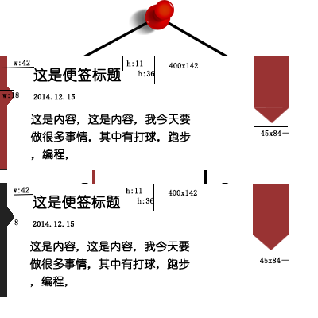

# memo 2.0 设计文档(目标)

## 设计目标
1. 做一个插件模块(考虑到之前windows上存在一些快捷键，但是不跨平台的问题。还有打算开发一些针对特定平台的插件，所以尽量能分离出这样一个模块)
2. 程序可以被其他人读懂。
  > 这就要求有相应的文档，变量和信号的发射都要在相应的文档中记录下来。

3. 

## 基本需求分析
### 文字描述
1. 实现可以切换文字背景和前景颜色
2. 时间是中文
3. 置顶功能

### 基本设计图

## 程序架构 (不确定)
`dataAccess.py`: 负责读取json文件和把json保存进入文件
`showLabel.py`: 显示 标题|时间|详细内容
`edit.py`: 编辑功能
`message.py`: 处理消息

### 程序编写注意的地方
1. 发射信号的地方，需要记录     
2. 类成员变量和函数

3. 编写一个dev环境用于开发时的测试之类

### 默认约定

## API接口
